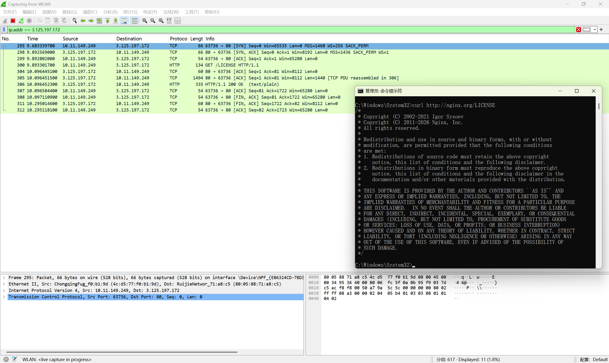
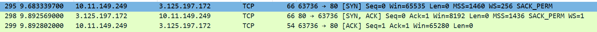
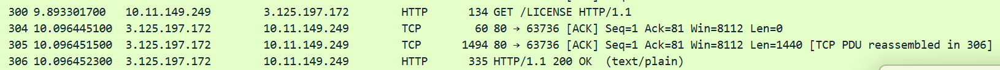
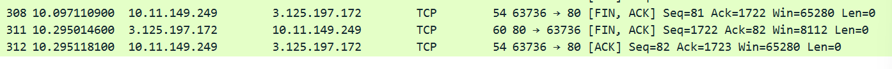
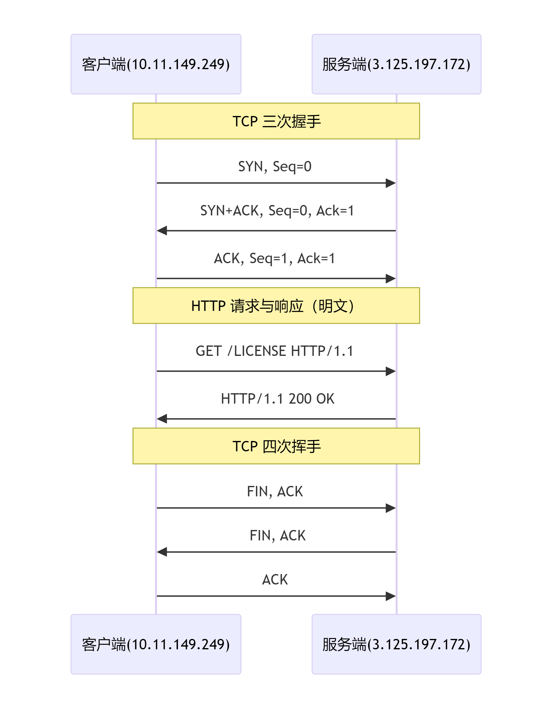

# wireshark-curl-nginx-http
# wireshark 抓包分析：curl访问Nginx.org的HTTP请求完整过程
## 实验目的
使用 Wireshark 抓取访问`curl`命令访问`http://nginx.org/LICENSE`时的网络流量，分析：
1. TCP三次握手（建立连接）；
2. HTTP请求与响应（明文）；
3. TCP四次挥手（断开连接）。
## 实验环境
- 客户端：Windows 11
- 服务端：Nginx 1.24（运行在 Ubuntu 22.04）
- 工具：curl、Wireshark
- 抓包网卡：WLAN
## 抓包步骤
1. 启动 Wireshark
2. 在命令行执行：
curl http://nginx.org/LICENSE
3. 停止抓包
4. 显示过滤器：
ip.addr == 3.125.197.172
## 抓包结果分析

Wireshark抓到了完整的TCP生命周期，共包含以下几个阶段：
### 阶段一：TCP三次握手

1. 客户端向服务端发送SYN，表示客户端发起连接，序号Seq=0。
2. 服务端接收到客户端的连接请求，向客户端发送SYN，ACK，表示服务端同意连接，序号Seq=0，确认号Ack=1
3. 客户端接收到服务端的序号和确认号之后，向服务端发送ACK，表示客户端确认，序号Seq=1，确认号Ack=1。

至此TCP三次握手完成，成功连接建立，双方进入ESTABLISHED状态。
### 阶段二：HTTP请求与响应（包300-305）

因为访问的是 http://（端口 80），数据是明文传输的，Wireshark 可以直接解析 HTTP 内容。
1. 客户端发起GET请求，`GET /LICENSE HTTP/1.1`
2. 服务端收到请求，响应`HTTP/1.1 200 OK (text/plain)`并开始传输数据，返回LICENSE内容
3. 客户端收到响应，并接受服务端传来的数据包

在Wireshark的Info列和底部报文详情中，可以直接看到HTTP请求头和响应头。
### 阶段三：TCP四次挥手（包306-312）

1. 客户端向服务端发送FIN、ACK，客户端请求关闭连接
2. 服务端收到客户端的关闭连接请求，确认无数据需要传送，则向客户端发送FIN、ACK，也请求关闭，此时属于半关闭状态
3. 客户端收到服务端的关闭连接请求，发送ACK确认，连接彻底关闭
## 完整时序图

## 为什么没有 TLS 握手？
本次实验使用的是 http://，端口为 80，是明文 HTTP 协议，因此没有 TLS 握手过程。如果使用 https://（端口 443），在三次握手之后、HTTP 请求之前，还会多出 TLS 握手（Client Hello、Server Hello、Certificate 等），且 HTTP 数据会变成加密的 Application Data，无法直接看到明文。
